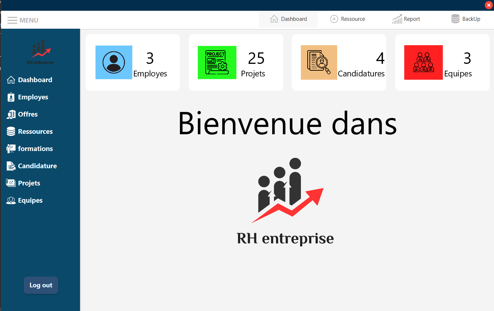
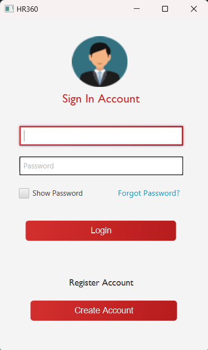
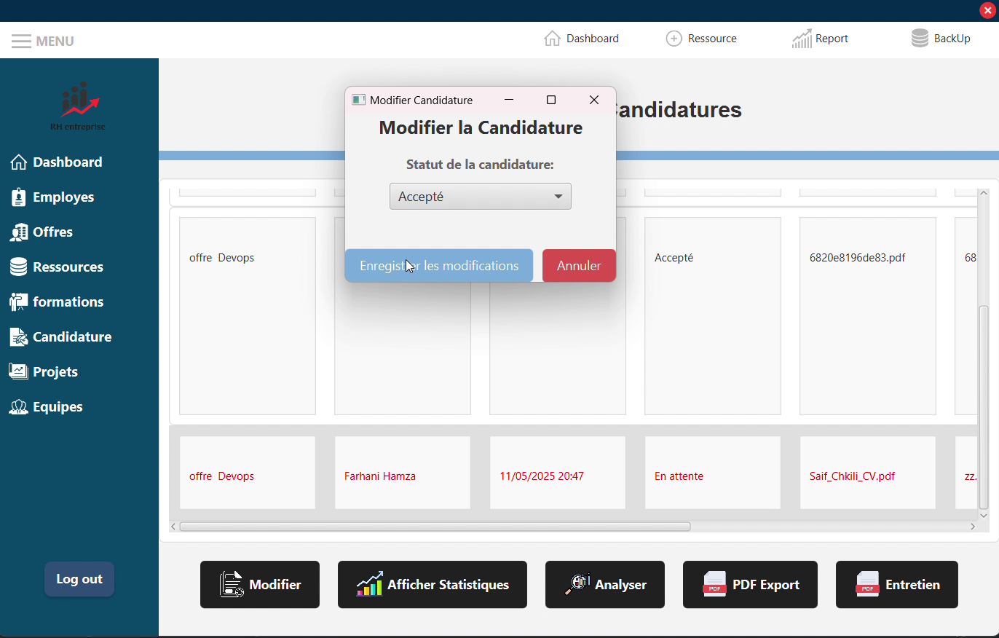
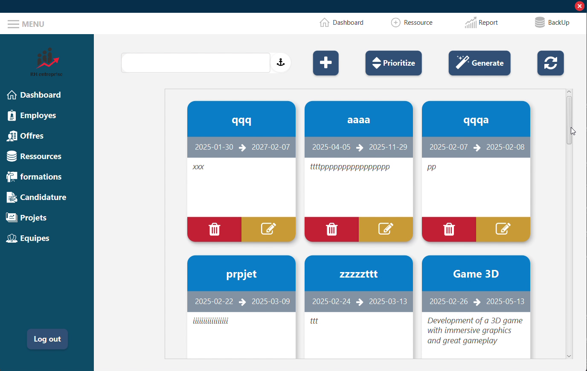
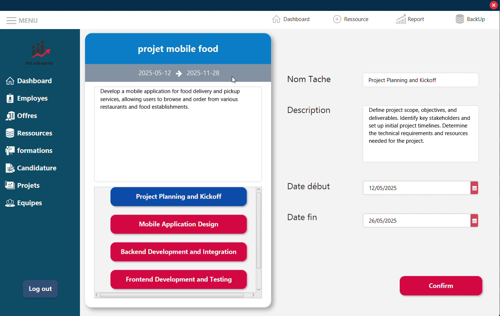
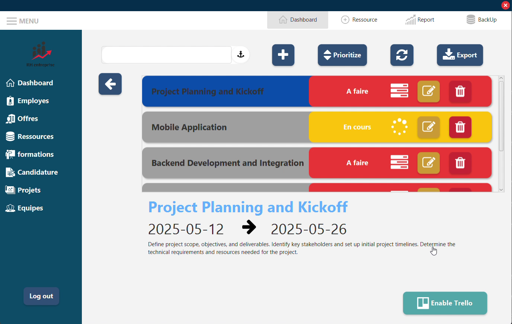
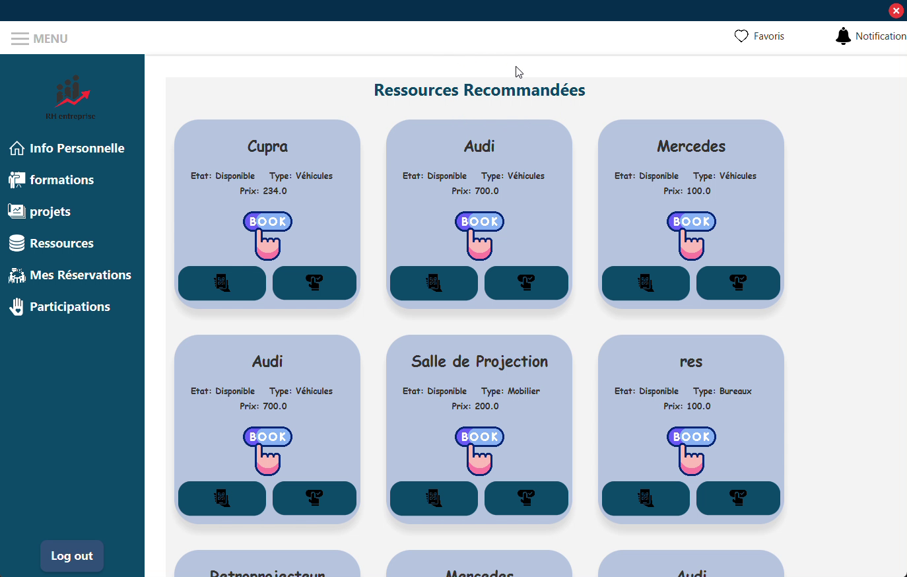
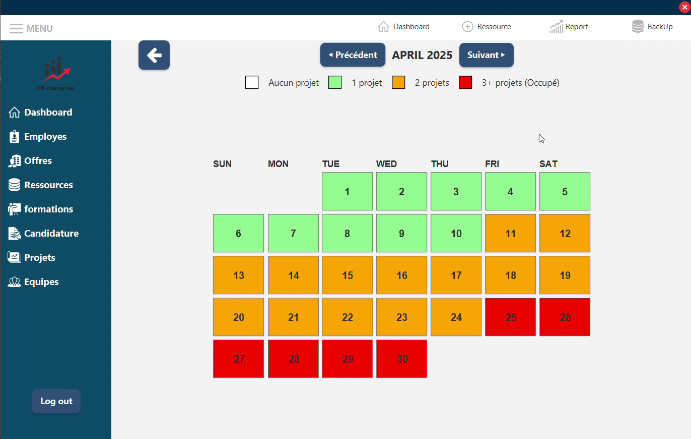
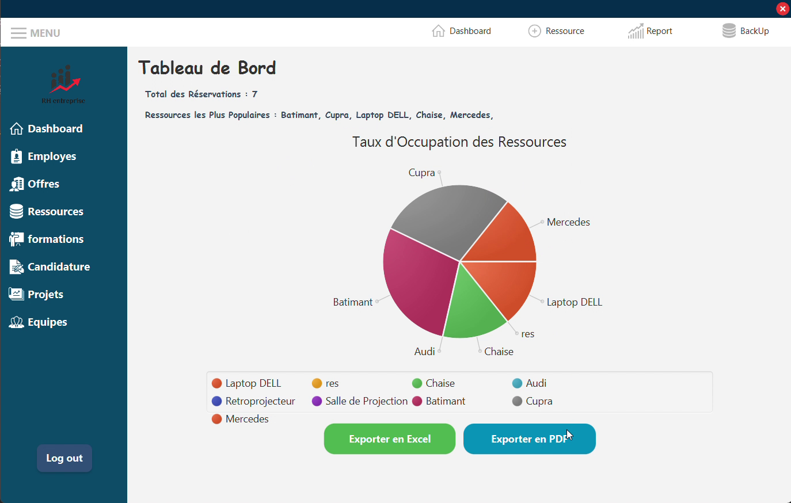

# HR360 - Plateforme Desktop de Gestion des Ressources Humaines

## 📌 Description
HR360 Desktop est la version bureau de notre plateforme web complète pour la gestion des RH. Elle offre les mêmes fonctionnalités que la version web mais avec une expérience native optimisée pour les ordinateurs.

## 🌟 Avantages de la Version Desktop
Performances accrues grâce à l'exécution locale

Intégration plus profonde avec le système d'exploitation

Fonctionnement hors ligne

Notifications système natives

Accès rapide via raccourcis clavier

---

## � Acteurs et Rôles
1. **RH (Admin)** : 
   - Gère tous les modules (offres, entretiens, formations, etc.).
   - Reçoit des statistiques et rapports.
2. **Candidat** : 
   - S'inscrit, postule aux offres.
   - Participe aux entretiens (Google Meet).
   - Consulte les évaluations.
3. **Employé** : 
   - Participe aux formations/projets.
   - Gère les tâches/réservations.
   - Consulte les ressources.

---

## 🛠 Fonctionnalités

### 🔐 Authentification & Sécurité
- **Inscription/Connexion** (Candidats/Employés).
- **Mot de passe oublié** (envoi d'email).
- **ReCAPTCHA** pour éviter les bots.
- **Cryptage** des mots de passe (bcrypt).

### 📢 Gestion des Offres & Candidatures
- **CRUD Offres** par le RH.
- **Postulation** des candidats.
- **AI** : Génération de description d'offre à partir du titre.
- **Traduction** & Correction grammaticale des descriptions.
- **Email** de changement d'état de candidature.

### � Entretiens & Évaluations
- **Planification** d'entretiens (Google Meet).
- **Quiz** intégré aux évaluations.
- **Rating** et feedbacks.
- **Notification** aux candidats.

### 📚 Formations
- **Chatbot AI** (Assistant pour les formations).
- **Gestion** des formations par le RH.

### 🏗 Projets, Tâches & Équipes
- **CRUD Projets/Équipes** par le RH.
- **AI** : Génération de tâches à partir du nom du projet.
- **Trello Board** synchronisé.
- **Calendrier** de charge d'équipe.
- **Changement de statut** des tâches (Employés).

### 📦 Ressources & Réservations
- **Réservation** de ressources (salle, matériel).
- **QR Code** pour accès aux ressources.
- **Paiement** via Stripe.
- **Recommandation** de ressources (AI).

### 📊 Reporting & Statistiques
- **Export Excel/PDF** (avec courbes).
- **Envoi par email** des rapports de performance.
- **Dashboard** RH avec indicateurs.

### 🔎 Autres
- **Recherche/Tri/Filtre** avancés.
- **Notifications** en temps réel.

---


---

## 🖼 Captures d'Écran
. **Dashboard RH** :  
   
. **Login** :  
   
   
. **Gestion des Candidatures et Offre** :  
   
. **Gestion des Projets et Taches** :  
   
   
   
. **Gestion des ressources et reservations** :  
  
. **Calendrier Charge** :
  
. **Statistiques** :
   
---

## 🚀 Installation
1. Cloner le dépôt :
   ```bash
   git clone https://github.com/ChkiliSaif741/HR360.git
